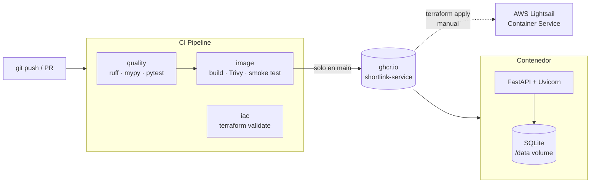

# shortlink-service

[](https://github.com/eironm3n/shortlink-service/actions/workflows/ci.yml)
[](https://github.com/eironm3n/shortlink-service/pkgs/container/shortlink-service)
[](./LICENSE)

Un acortador de URLs mínimo pero real, usado como **pieza de portafolio DevOps**:
lo importante no es el acortador, es *cómo se construye, prueba, empaqueta,
escanea, publica y despliega*.

```
POST /api/links        {"target_url": "https://ejemplo.com/una/pagina/larga"}
      -> 201  {"code": "aB3xK9p", "short_url": ".../aB3xK9p", "visits": 0}

GET  /aB3xK9p          -> 307 Location: https://ejemplo.com/una/pagina/larga
GET  /api/links/aB3xK9p -> {"visits": 1, ...}
GET  /healthz          -> {"status": "ok"}
GET  /version          -> {"version": "<git sha>"}
```

## Arquitectura



## Qué demuestra este repo

Respuesta directa a "¿cómo se muestra el expertise?": cada competencia está
anclada a un archivo concreto, y todo es **verificable públicamente** (badge de
CI en verde, imagen en GHCR, historial de ejecuciones del pipeline).

| Competencia | Dónde se ve |
|---|---|
| **Contenedores** | [`Dockerfile`](./Dockerfile): build multi-stage, imagen final `slim`, usuario no-root (`uid 1000`), `HEALTHCHECK`, volumen para datos |
| **CI/CD** | [`.github/workflows/ci.yml`](./.github/workflows/ci.yml): 3 jobs — `quality`, `image`, `iac` — con dependencias, caché de capas (`type=gha`) y publicación condicional (`only main`) |
| **Seguridad de la cadena** | Escaneo con **Trivy** en el pipeline · `permissions` mínimos por job · sin secretos propios (sólo `GITHUB_TOKEN`) · contenedor no-root |
| **Infra como código** | [`infra/`](./infra): Terraform para AWS Lightsail (servicio de contenedor + health check), formateado y validado en cada push |
| **Testing** | [`tests/`](./tests): `pytest` con cobertura mínima del 90 % (`--cov-fail-under=90`), fixture de base de datos SQLite en memoria con `StaticPool` |
| **Calidad de código** | `ruff` (lint + formato) y `mypy` (`disallow_untyped_defs`) sobre `app/` |
| **Observabilidad básica** | Endpoints `/healthz` y `/version`; el `HEALTHCHECK` del contenedor consume `/healthz`; `/version` reporta el SHA del commit desplegado |
| **12-factor / config** | [`app/config.py`](./app/config.py): toda la config por variables de entorno `SHORTLINK_*` |

## Puesta en marcha

### Con Docker (recomendado)

```bash
docker compose up --build
# API en http://localhost:8000 · docs en http://localhost:8000/docs
```

### Local, para desarrollo

```bash
make install     # crea .venv e instala dependencias de dev
make dev         # uvicorn con --reload
make lint        # ruff + mypy
make test        # pytest + cobertura
make docker      # build de la imagen
```

## Pipeline de CI

Cada `push` a `main` y cada Pull Request dispara:

1. **`quality`** — `ruff check`, `ruff format --check`, `mypy app`, `pytest` (falla si la cobertura baja del 90 %).
2. **`image`** — build de la imagen, escaneo con Trivy (falla ante CVE `CRITICAL` con fix disponible), *smoke test* real (levanta el contenedor y valida `healthz` + crear link + redirect). En `main`, además publica `:latest` y `:<sha>` en GHCR.
3. **`iac`** — `terraform fmt -check`, `init` y `validate` sobre `infra/` (sin credenciales de AWS, sin costo).

## Despliegue

La infraestructura está descrita en [`infra/`](./infra). El `apply` es **manual y
opcional** porque un Lightsail Container `nano` cuesta ~USD 7/mes; el detalle
está en [`infra/README.md`](./infra/README.md).

## Decisiones y límites (a propósito)

- **SQLite + volumen** en vez de Postgres: alcanza para la demo y mantiene la
  imagen y el `compose` simples. En producción real iría Postgres + Alembic.
- **Código aleatorio** de 7 caracteres con reintento ante colisión, en vez de
  contador base62: evita exponer el volumen de links y simplifica la concurrencia.
- **Sin auth ni rate limiting**: fuera del alcance de esta pieza; el foco es la
  cadena de build/deploy, no el producto.

## Roadmap

- [ ] Backend Postgres opcional + migraciones con Alembic
- [ ] Métricas Prometheus (`/metrics`) y dashboard de Grafana en el `compose`
- [ ] Backend remoto de Terraform (S3 + DynamoDB lock)
- [ ] Deploy automático a Lightsail desde el pipeline (con `AWS_*` en secrets)
